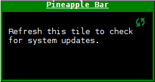
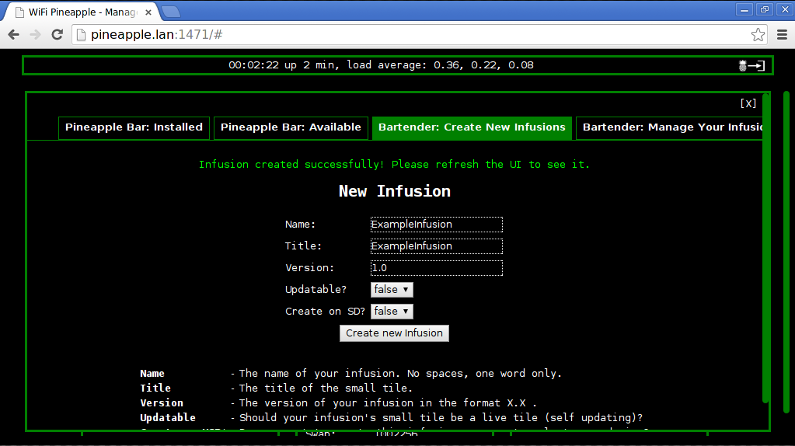

# Creating Infusions

## What are Infusions?

Infusions are extra pieces of code formed in tiles. Each infusion needs atleast 3 files, A 'small_tile.php', 'large_tile.php', and a 'handler.php' file. The 'small_tile.php' file should contain maybe a log output and a refresh function, or a small description on the Infusion. The 'large_tile.php' should contain your major functions of the Infusion. The 'handler.php' file should only be edited when you update your infusion, changing the infusion version.

## How to make an Infusion?
Creating infusions is easy, now that it is possible to do it from the Pineapple Bar. To create an infusion, simply open the large tile for the Pineapple bar.



Now, Click on the create tab and enter the infusions name, version, tile, and toggle whether you want it to be up-datable (Refreshes the tile every 5 seconds), and whether you want it to be installed to the SD Card.



Refresh your pineapples Web UI and find your new tile, both small and large tile will be empty. SCP your code from pineapple to computer, edit the code and scp it back over to test. You can also whip up a very quick infusion for a specific need with the built in editor, also found in the bartender infusion.

## What do these files do?

Four files are created by default, by the bartender infusion, named 'small_tile.php', 'large_tile.php', 'functions.php' and finally 'handler.php'.

The small_tile.php is the tile you click on the index of the Web UI, this can contain HTML/PHP code too. This is usually used for logs or descriptions of the infusion.

The large_tile.php is the large tile you get from clicking on the small tile. This tile should be used to host the main features of the infusion. Please look at [#ajax] for more information on using forms.

The functions.php file is used in conjunction with the AJax method for forms. It is commonly used by having PHPs 'isset' to check if the form has sent a POST method, then executes PHP code. Please look at the example at the bottom of the page.

The handler.php file is used by the system. It specifies the infusion name, title and version. This should only be edited for updating the version variable.

## AJAX

The pineapples large_tile for infusion works in a Javascript popup type method, using regular HTML forms would cause this to break, so we use AJAX. This prevents the pineapple going to a new page. More information can be found in the example section below.

## Example

In this guide, We will make a simple infusion that contains small_tile.php code, large_tile.php code, functions.php code and demonstrates the popup() and notify() features of the API.

Firstly, create a new infusion called 'ExampleInfusion' as told above. In this example, I have SCP'd the files created by the Pineapple Bar to my machine, where I edited them in an editor. Also remember that the real way to learn from an example is to type it out, not just copy and paste it.

Open the files in your favourite editor, and keep on the small_tile.php file. In the small tile, we will create a Refresh function with Javascript and check to see whether a program is running on the pineapple, while notifying you that you have used the refresh function.

The code below does this :

```php
<html>
<head>
<script type="text/javascript">
function refreshSmall();
{
	refreshSmallTile(ExampleInfusion);
	notify('You used the Refresh button!');
}
</script>
</head>

<?php

exec("pgrep dnsspoof", $dnsspoofrunning);
if(empty($dnsspoofrunning))
	{
		echo "DNSSpoof is not Running.";
	}
else { echo('DNSSpoof is Running'); }

?>

<a href="#" onClick="refreshSmall();">[Refresh]</a>

</html>
```

The above code makes a refresh button that will refresh the small tile named ExampleInfusion, as well as telling you whether 'DNSSpoof' is running or not. For the large_tile, we will add a textbox and a submit to demonstrate the popup() function and to demonstrate the AJAX forms.

In your large_tile.php, you need this code :

```
<form action="/components/infusions/ExampleInfusion/functions.php" method="POST" onSubmit="$(this).AJAXifyForm(callback); return false;">
  <input type="text" name="text" placeholder="Enter some Text" />
  <input type="submit" name="submit" value="Submit">
</form>

<script type="text/javascript">
function callback(data){
  popup(data);
}

</script>
```
and in your functions.php, you need this code :

```php
<?php

if(isset($_POST['submit'])){
  echo "You selected: ".$_POST['text'];
}

?>
```

The above pieces of code will display a textbox and a submit button inside of an AJAXified form. Then it will post to the functions.php and that file will look for the submit button name. It will then output the input of the textbox you made before.
