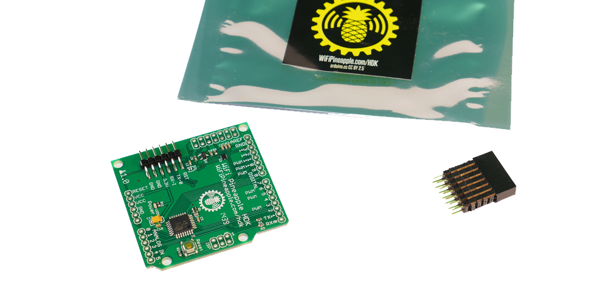
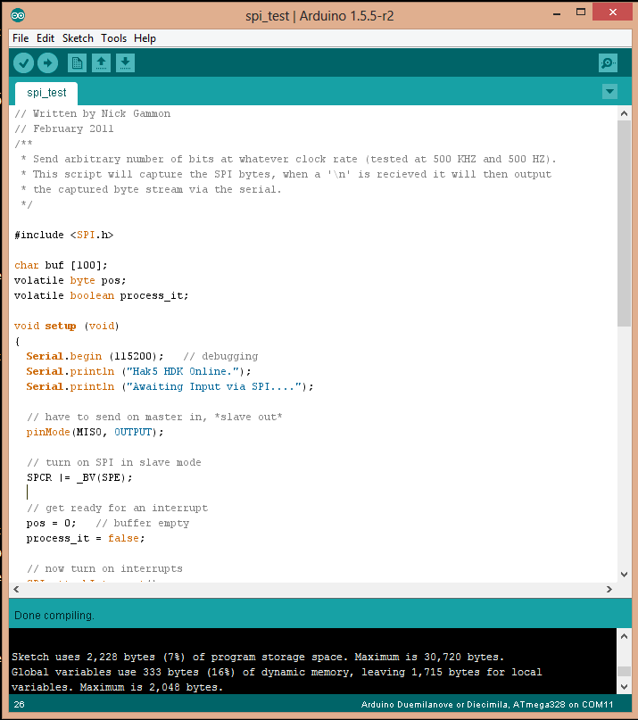

# Getting Started with the HDK

## Things you will need

1. The HDK
2. A Wifi Pineapple
3. A Soldering iron
4. A programmer (an arduino is fine)
5. Wires
6. (optionally) a USB to serial converter.



## Set up of the HDK in the Pineapple

The HDK talks to the Wifi pineapple via a bit-banged SPI interface, using on board gpios. These are not enabled by default. In order to enable the interface, type:

`/sbin/insmod spi-gpio-custom bus0=1,18,20,19,0,125000,21`

Once this command has been run, a new device /dev/spidev1.0 will be created. 

## Soldering the HDK


## Programming the HDK

The easiest way to program the HDK is via an Arduino. This allows you to use the Arduino IDE, (optionally test) and deploy the code via 



### Example program 

```C

```

### Programming the HDK


### Testing


## Additional Information + Useful Links

https://randomcoderdude.wordpress.com/2013/08/15/spi-over-gpio-in-openwrt/
