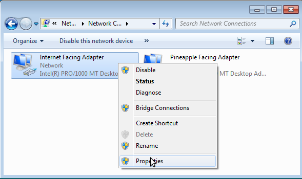
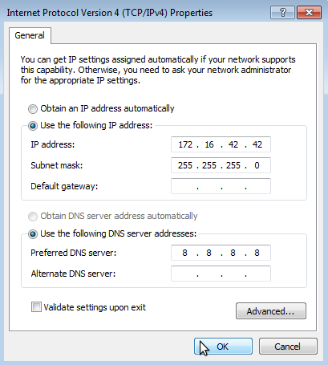

# Internet Connection Sharing

## Linux ICS

With an Ethernet cable connected to the WiFi Pineapple, Internet access may be shared from an online computer. This is typically achieved with a cable connected between a notebook computer and the WiFi Pineapple directly. The notebook computer requires some form of Internet access (typically through WiFi or Mobile Broadband).

By default the WiFi Pineapple has an IP address of 172.16.42.1 and will assign WiFi clients with IP addresses in the 172.16.42.100-150 range via an onboard DHCP server. The default gateway of the WiFi Pineapple is 172.16.42.42. This means the WiFi Pineapple is looking for an Internet connection from a host with this IP address. A simple tethering script is available for Linux host which will automatically setup the IP and forwarding.

  1. Power on the WiFi Pineapple
  2. Connect an Ethernet cable directly between the LAN port on the computer and the LAN port on the WiFi Pineapple
  3. On the computer, download the wp5.sh script from wifipineapple.com [here](https://wifipineapple.com/mk5/scripts/wp5.sh)
  4. Make the script executable with `chmod +x wp5.sh` and run the script as root (e.g. `sudo ./wp5.sh`)
  5. Follow the on screen prompts


## Windows ICS

While there is currently no quick-connect script for Windows, it is a fairly simple and straightforward setup. First we must understand that by default with WiFi Pineapple has an IP address of 172.16.42.1 and like a regular WiFi Rouger we assign clients IP addresses in the range of 182.16.42.50-250. When tethering a PC via Ethernet or Wireless, the WiFi Pineapple will use a default gateway IP address of 172.16.42.42.

So if the Windwos hosts's Pineapple-Facing adapter is configured with a static IP address of 172.16.42.42 and an Internet-Facing adapter (for example from another WiFi network or a USB mobile broadband modem) is configured for Internet Connection Sharing, clients connected to the WiFi Pineapple will get online throught he Windows hosts Internet connection.

Begin by powering on the WiFi Pineapple and directly connecting an Ethernet cable between the WiFi Pineapple and PC. Open **Network Connections** on the PC and view the properties of the Internet-facing adapter.



From the Sharing tab, check the box labeled *Allow other network users to connect through this computer's Internet connection* and click OK. You may need to select an network connection if there is more than one.


Next view the properties of the Pineapple-facing adapter.


Select **Internet Protocol Version 4 (TCP/IP)** and select Properties.


Check *Use the following IP address* and specify 172.16.42.42 for the IP address and 255.255.255.0 for subnet. Leave the default gateway blank. Next check **Use the following DNS server addresses** and provide your preferred DNS server (e.g. Google's 8.8.8.8) and click OK then Close.



The WiFi Pineapple-facing and Internet-facing adapters have been configured and Internet Connection Sharing has been enabled.

## OSX ICS

How-to provided by http://champagneandsecurity.wordpress.com/2014/10/03/wifi-pineapple-and-mac-os-x-internet-sharing/

This one is for you Mac users out there that want to share your Mac's WiFi internet connection via the LAN cable to the WiFi Pineapple. Using the out of the box Internet sharing option of your Mac doesn't work with the WiFi Pineapple. I had experienced it again, but never gave it any good look and switched to Linux. Today I it frustrated me and I looked into it.

The problem with the setup is twofold:

  1. The Pineapple expects the 172.16.42.0 subnet, while OS X uses 192.168.2.0 when enabling internet sharing.
  2. The Pineapple expects the default gateway on 172.16.42.42 which is not a very logical address for a gateway. Now, we could change all these settings on the Pineapple to match the Mac's. But sometimes your situation may require different. I couldn't find any manual on the internet.

So here are the steps you need to do:

  1. Disconnect cables from Mac's LAN to Pineapple.
  2. On the Mac go to Internet Sharing and share your WiFi adapter to the LAN interfaces. Once enabled, disable it again and close the System Preference program. We need this step to write a default config file that we can alter.
  3. The config file that we need to alter is **/Library/Preferences/SystemConfiguration/com.apple.nat.plist** We need to add an option `SharingNetworkNumberStart 172.16.42.0`. You can manually add this as a dict at the end of the file, or you can use the command:
  ```
  sudo defaults write /Library/Preferences/SystemConfiguration/com.apple.nat NAT -dict-add SharingNetworkNumberStart 172.16.42.0
  ```
  This makes sure that 172.16.42.0/24 is now used as the subnet for the sharing interface, and as such fixes our first problem.
  4. Use the GUI again to start Internet Sharing.
  5. Manually change the IP address used by the Mac's LAN interface with the command: `ifconfig bridge100 172.16.42.42 netmask 255.255.255.0 up`.
  6. Now we need to change some DHCP options, because by default the DHCP server tells the clients to use gateway 172.16.42.1. We do this by altering file `/etc/bootpd.plist`. There are two mentions of 172.16.42.1 that we need to change into 172.16.42.42. We also need to adjust the pool range. Look for the `<key>net_range</key>` section. Alter the starting address to 172.16.42.43.
  7. Find the PID of the bootpd process and give it a kill -HUP to reread its config file.

That's it. Now you can connect the LAN cable and enjoy internet from your Pineapple.

## Android ICS

If your Android device support USB Tethering it may be used to provide Internet access to the WiFi Pineapple, sharing either the Android's WiFi or Mobile Broadband connection. To enable, connect a USB cable between the Android device and the WiFi Pineapple. With the WiFi Pineapple powered on and a USB cable connected between both devices, tethering is now possible.

Since Android 2.3 (Gingerbread) devices, the USB tethering option will be found from the Settings menu (typically from Wireless and Networks, Tethering and Portable Hotspot). Simply check the box labeled **USB Tethering**.


In this configuration the WiFi Pineapple will obtain a new interface, usb0, and routing will automatically adjust to use the Android device as the WiFi Pineapple's default gateway. No configuration is necessary on the WiFi Pineapple. To discontinue use of Android USB Tethering, either disconnect the USB cable or uncheck the USB Tethering checkbox. The WiFi Pineapple will automatically disable the usb0 interface and reset the routing configuration to defaults.
