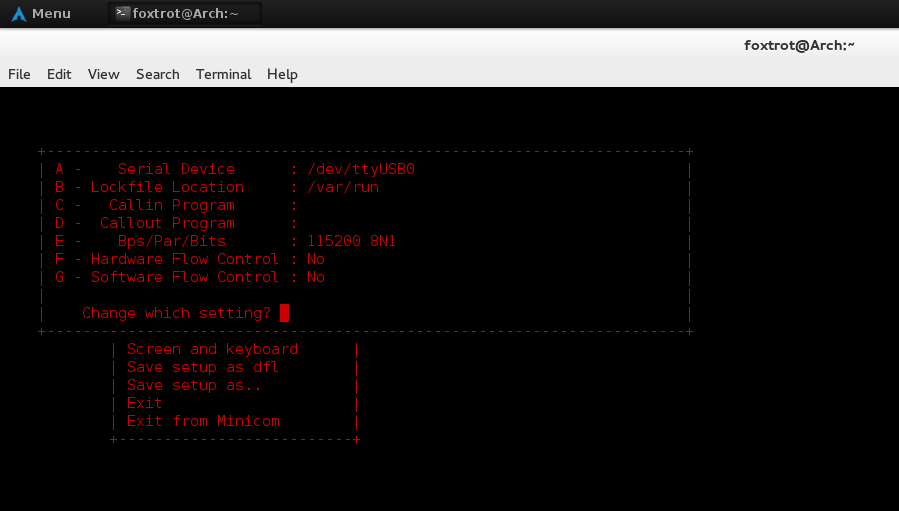
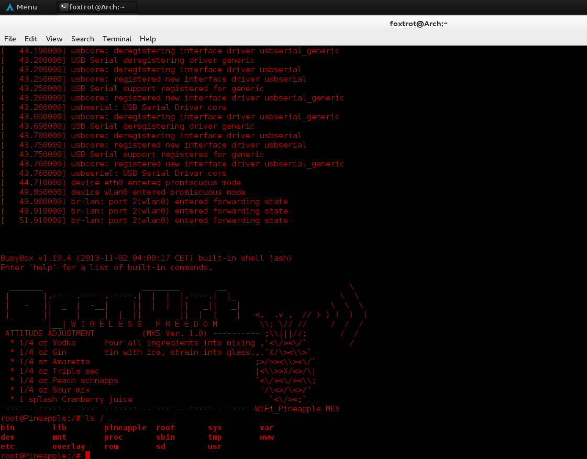
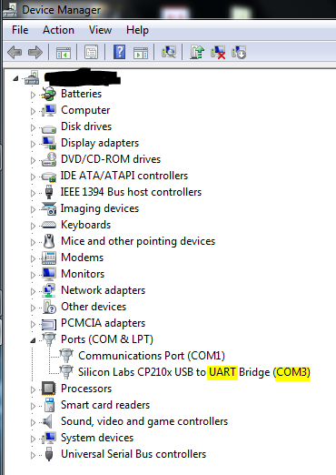
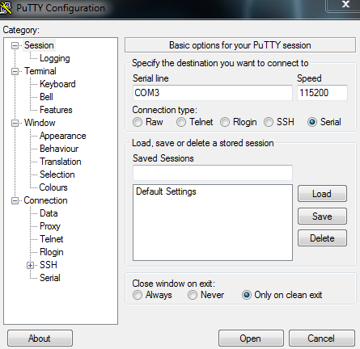
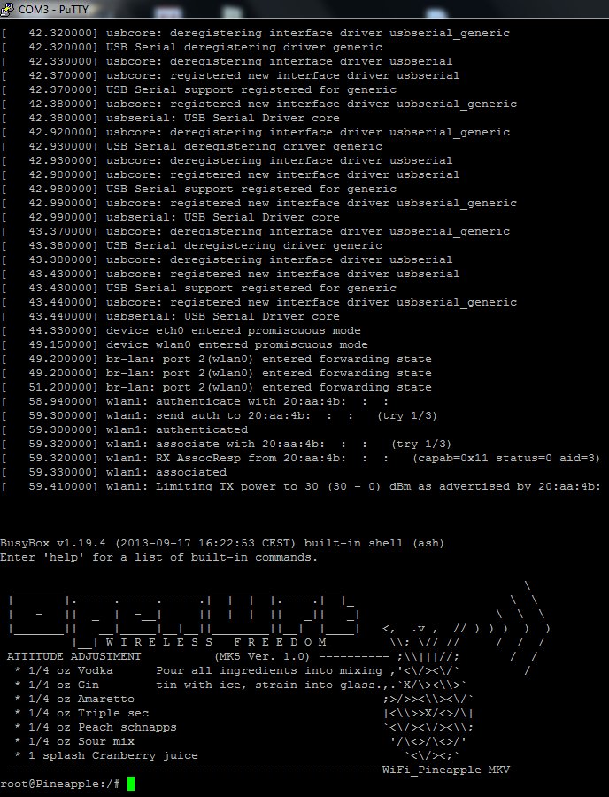

# Serial UART (Universal Asynchronous Receiver/Transmitter)

The WiFi Pineapple has a UART Serial interface mainly purposed for debugging and recovery. Accessing your Pineapple via the UART Serial will give you terminal shell, similar to if you were to SSH in over a network. To access the UART you will need a TTL-UART-Serial adaptor. A recommended one would be the USB Adaptor with a CP2102 Chip. These can be bought from the [Hakshop](https://hakshop.myshopify.com/).

## Accessing the UART on Linux

To access the UART on Linux, You will need the following tools:

  + A UART Serial Adaptor.
  + Minicom (A Free Linux Utility)

**1)** You will need to connect the UART Adapter to the WiFi Pineapple. To do this, please refer to both the manual that you recieved with your pineapple and the table below (MK5 only). Double check that the device is oriented the same as the image in the manual.

The table below is for the MK5, Left to Right when looking at the serial pins and the corresponding UART serial adaptor pins in order to send and recieve over serial pins.

**MK5 Pin Connection Layout**

|  MK5 	| UART Serial Adaptor 	|
|:----:	|:-------------------:	|
|  GND 	|         GND         	|
|  RX  	|          TX         	|
|  TX  	|          RX         	|
| 3.3v 	|    Not connected    	|

Warning: **(DO NOT PLUG IN THE VCC/VDD VOLTAGE PIN!)**

**2)** First, check what name your UART adaptor has, to do this, execute `ls /dev/tty*` and look for a ttyUSBx. Like this :

**3)** Next, after install minicom with your favourite package manager. If you are running a Debian-based distro (such as Ubunutu and its variants), then you only need to type `sudo apt-get install minicom` in a terminal. Once you've installed it, run it as root with `sudo minicom -s` and enter into the 'Serial Port Setup' option. It will present you with a screen similiar to this, you need to change your existing commands to these, with the /dev/ttyUSB0 reflecting your adaptor name:

**4)** Now press ESC and exit from minicom, Then run 'sudo minicom', and connect your pineapple to the Wall Adaptor powersource, you should see information flow through the terminal. After the pineapple has a solid blue light, you can press return on your keyboard to drop into a shell.

## Accessing the UART on Windows

To access the UART on Windows, You will need the following tools:

- A UART Serial Adapter.
- PuTTY (or alternative such as KiTTY)

**1)** You will need to connect the UART to the WiFi Pineapple. To do this, please refer to the manual that you recieved with your pineapple. Double check the device is oriented the same as the image in the manual.

Warning: **(DO NOT PLUG IN THE VCC/VDD VOLTAGE PIN!)**

**2)** First, you will need to open Device Manager and check what COM port number your UART facing serial interface has. Like this :

**3)** Next, open PuTTY and select the radio button for serial and then proceed to set the serial line to whatever you found in Device Manager. Set the speed to 115200. All of the other settings can remain at their defaults.

**4)** Now, press open and connect your Pineapple to a power source, you should see information flow through the terminal. After the pineapple has a solid blue light, you can press enter on your keyboard to drop into a shell.

